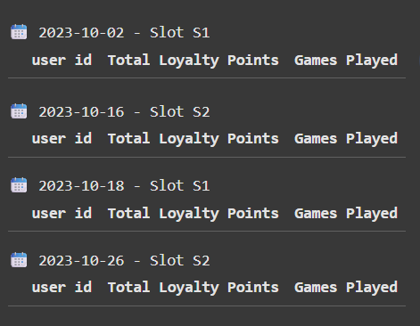
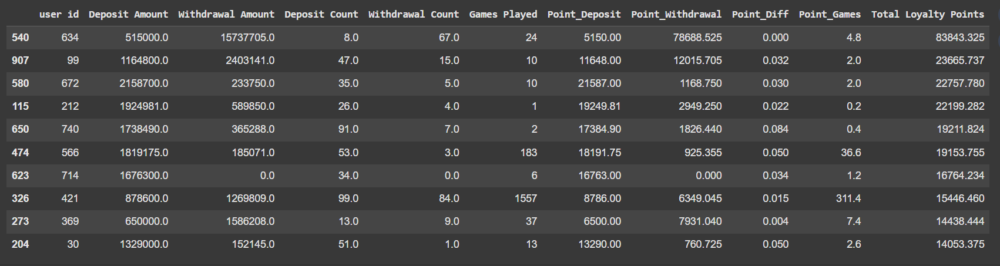
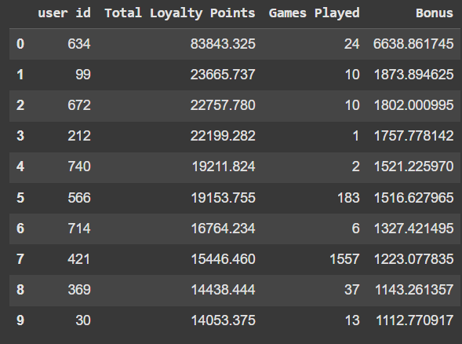

# Loyalty Analytics Engine – Real-Money Gaming Platform
A data analytics solution for a real-money gaming platform to compute loyalty points, analyze user activity by time slots, allocate bonus rewards, and evaluate reward fairness.

## Assignment Dataset & Instructions

This project is based on a real-world internship assignment involving player activity tracking and loyalty point systems.

[View Assignment Instructions & Raw Dataset (Google Sheets)](https://docs.google.com/spreadsheets/d/1LQzDOnIMUm81bLXlj6tzM_qCvUHO2ghHFMY5RW90V9k/edit?gid=1868309109#gid=1868309109)

The Google Sheet contains:
- Problem Statement & Formulas
- Game Play Data
- Deposit & Withdrawal Data

---

This project implements a complete loyalty system for ABC, a real-money online gaming company offering multiplayer games like Ludo.

It includes user behavior analysis, slot-based time segmentation, loyalty point calculation, leaderboard ranking, bonus distribution, and fairness review.

---

## Key Highlights of the Project

- Designed a full loyalty point analytics engine for a real-money gaming platform
- Built dynamic point calculation based on user deposits, withdrawals, and gameplay activity
- Implemented slot-based analysis (S1/S2) using time-based filtering
- Ranked users monthly and distributed ₹50,000 bonus using proportional fairness
- Evaluated and improved the reward system to prevent exploitation
- Learned real-world data cleaning, business rule translation, and behavioral analysis

## Project Files

| File | Description |
|------|-------------|
| `Loyalty_Analytics_Engine_Gaming_Platform.ipynb` | Full Jupyter/Colab notebook implementation |
| `Loyalty_Analytics_Engine_Gaming_Platform_Report.pdf` | Final written report with explanations |
| `requirements.txt` | Python dependencies |
| `images/slot_loyalty_output.png` | Screenshot: Slot-based loyalty calculation output |
| `images/monthly_leaderboard_loyalty_points_output.png` | Screenshot: Monthly leaderboard of loyalty points |
| `images/bonus_distribution_output.png` | Screenshot: Bonus distribution for Top 50 players |

---

## Loyalty Formula Used
Loyalty Points =
0.01 × Deposit Amount +
0.005 × Withdrawal Amount +
0.001 × max(#Deposits - #Withdrawals, 0) +
0.2 × Games Played

---

## Features Implemented

-  **Google Sheet Integration** via GSpread
-  **Time Slot Calculation (S1: 12AM–12PM, S2: 12PM–12AM)**
-  **Game, Deposit, Withdrawal data aggregation**
-  **Monthly loyalty point leaderboard**
-  **Bonus Distribution Strategy (Top 50 players)**
-  **Fairness Analysis** of loyalty system and improvement suggestions

---

## 🔧 Tech Stack

- **Python** with Pandas
- **Google Colab** / Jupyter Notebook
- **GSpread & OAuth2** for Google Sheet access
- **Data Wrangling & Business Logic Design**

---

## Learnings

- Real-world data cleaning (non-standard headers, slot segmentation)
- Translating business logic into Pythonic functions
- Reward system design & ethical evaluation

---

## Screenshots

### Slot-Based Loyalty Points (Part A – Q1)

The system calculates loyalty points based on specific dates and time slots (S1 / S2).

---

### Monthly Loyalty Leaderboard (Part A – Q2)

This leaderboard ranks users based on loyalty points earned throughout the month.

---

### Bonus Distribution to Top 50 Players (Part B)

Bonus of ₹50,000 is distributed proportionally to the top 50 users based on their loyalty points.

---

## Tags

`python` `data-analysis` `loyalty-system` `gspread` `rewards` `google-colab` `gamification` `slot-analysis` `ranking` `pandas`

---

## 🤝 Built By
👨‍💻 **Sonu Kumar**  
## 🤝 Contact Me
🔗 [LinkedIn Profile](https://www.linkedin.com/in/hhsksonu)  
🔗 [GitHub Profile](https://github.com/hhsksonu)
